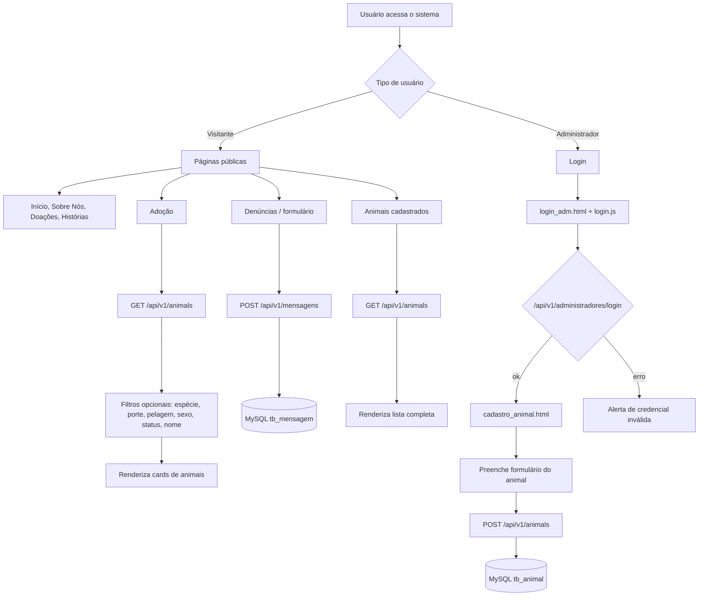

# Fluxograma do Sistema - Apoio Pet (PI 1º Semestre)

## Legenda

- **Retângulos:** Entidades JPA / Controllers / Services / Repositories
- **Setas sólidas:** Chamadas entre camadas
- **Setas tracejadas:** Relacionamentos JPA entre entidades
- **Caixas agrupadas:** Contexto lógico por módulo

## Descrição do Fluxo

1. **Visitante** acessa páginas públicas e navega por conteúdo institucional e adoção.
2. **Administrador** acessa `login_adm.html` e autentica via `login.js` consumindo `POST /api/v1/administradores/login`.
3. Após login, o admin pode cadastrar animais (`cadastro_animal.html`) enviando dados para `POST /api/v1/animals`.
4. A página de adoção consulta animais via `GET /api/v1/animals` com filtros opcionais.
5. Denúncias/relatos são enviados para `POST /api/v1/mensagens` e seus emails para `POST /api/v1/emails`.
6. Todas as requisições seguem o padrão REST: **Controller → Service → Repository → MySQL**.
